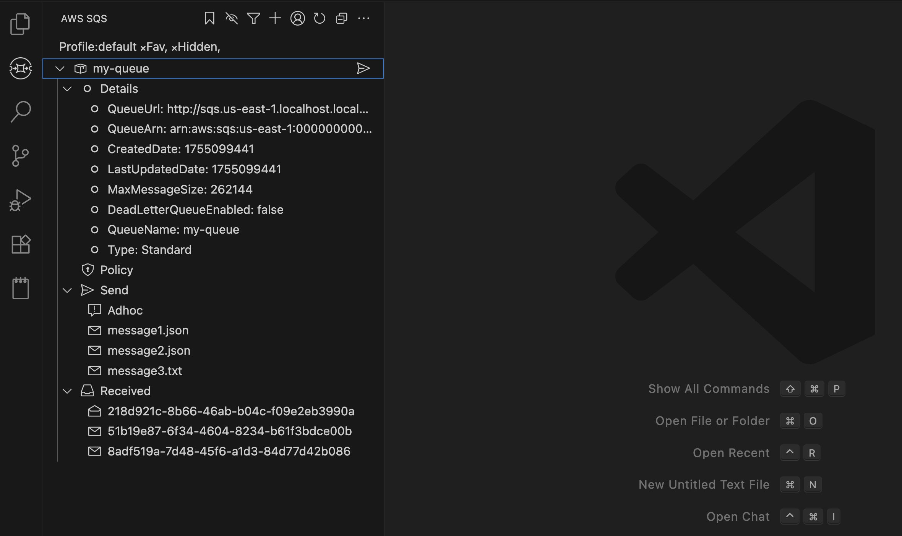

# Aws Sns Extension for VSCode

🚀 **AWS Sns Extension for VSCode** allows you to interact with your AWS Sns Topics directly within VSCode. This extension streamlines the development, testing, and debugging of Sns Topics, providing an intuitive interface for publishing messages within your favorite code editor.  

## ✨ Features  

- **Publish Messages**: Publish messages to AWS Sns Topics with ease. 
- **Manage Messages**: Save and reuse messages for later use.
- **Subscriptions**: Monitor subscriptions to AWS Sns Topics.
- **AWS Profile Support**: Work with multiple AWS profiles seamlessly.  

## Sponsor Me
If you find this extension useful, you can [sponsor me on GitHub](https://github.com/sponsors/necatiarslan).

## Survey
Please take this survey to help me make the extension better.\
TODO: Add Link

## Endpoint Url
You can change your aws endpoint url here. To connect your localstack use the following url: http://localhost:4566

## Aws Credentials Setup
To Access Aws, you need to configure aws credentials. 

For more detail on aws credentials \
https://docs.aws.amazon.com/cli/latest/userguide/cli-configure-files.html \
https://www.youtube.com/watch?v=SON8sY1iOBU

Extension supports all types of credentials. It searches for aws credentials in the following order:
- Environment Variables:
  - AWS_ACCESS_KEY_ID
  - AWS_SECRET_ACCESS_KEY
  - AWS_SESSION_TOKEN (optional, for temporary credentials)

- Shared Credentials File:
  - ~/.aws/credentials (default profile or a named profile)
  - ~/.aws/config (for region settings)

- Amazon EC2 Instance Metadata Service (IMDS):
  - When running on an EC2 instance with an attached IAM role, credentials are retrieved from http://169.254.169.254/latest/meta-data/iam/security-credentials/

- Amazon ECS Container Credentials:
  - When running in an ECS task, the SDK retrieves credentials from the container metadata URI (provided by ECS agent).

- SSO Credentials:
  - If you've configured SSO using the AWS CLI, the SDK will attempt to retrieve credentials from your SSO login session.

- Web Identity Token (IAM Roles for Service Accounts):
  - For federated identity access, such as AWS IAM roles for Kubernetes (EKS).

## Bug Report
To report your bugs or request new features, use link below\
https://github.com/necatiarslan/aws-sqs-vscode-extension/issues/new

## Todo
- 

## Nice To Have
- 

Follow me on linkedin to get latest news \
https://www.linkedin.com/in/necati-arslan/

Thanks, \
Necati ARSLAN \
necatia@gmail.com

Other Extensions
- https://bit.ly/aws-access-vscode-extension
- https://bit.ly/vscode-aws-sns
- https://bit.ly/aws-cloudwatch-vscode-extension
- https://bit.ly/airflow-vscode-extension